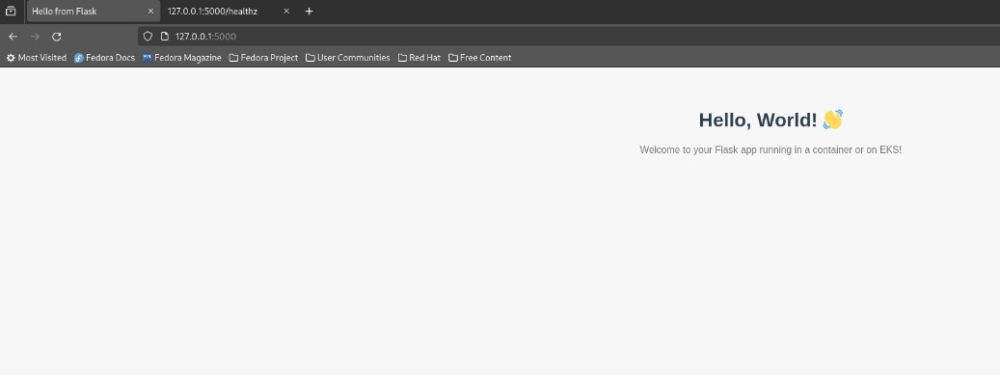
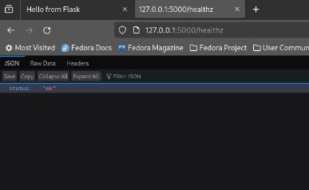

# ☁️ Project 2bcloud Exercise

## 📄 Overview

This repository contains infrastructure code, CI/CD pipeline configurations, Helm charts, and application code for deploying a Flask-based web application on EKS using Terraform.

### 📁 Project Structure


```pgsql
2bcloud-exercise-master
│   README.md
│
├── .github/
│   └── workflows/
│       ├── CD-2bcloud-flow.yml
│       ├── CI-2bcloud-flow.yml
│       ├── terraform-tf-state-s3.yml
│       ├── terraform-ecr.yml
│       └── terraform-eks-nodegroup.yml
│
├── aws/
│   ├── eks-cluster-trust-policy.json
│   ├── eks-nodegroup-trust-policy.json
│   ├── launch-template-access-policy.json
│   ├── node-role-trust-relationship.json
│   └── roles.txt
│
├── helm-charts/
│   └── hello-flask-app/
│       ├── Chart.yaml
│       ├── values.yaml
│       ├── values.yaml_with_ingress
│       └── templates/
│           ├── deployment.yaml
│           ├── ingress.yaml_notrun
│           └── service.yaml
│
├── terraform/
│   ├── ecr/
│   │   ├── main.tf
│   │   ├── providers.tf
│   │   ├── variables.auto.tfvars
│   │   └── variables.tf
│   │
│   ├── eks-flask-app/
│   │   ├── access.tf_notrun
│   │   ├── data.tf
│   │   ├── deploy-app.tf_notrun
│   │   ├── eks.tf
│   │   ├── iam.tf_notrun
│   │   ├── iam_policy.tf_notrun
│   │   ├── outputs.tf
│   │   ├── providers.tf
│   │   ├── variables.tf
│   │   ├── vpc.tf
│   │   └── k8s/
│   │       ├── deployment.yaml
│   │       └── service.yaml
│   │
│   └── tf-state-s3/
│       ├── main.tf
│       ├── outputs.tf
│       ├── Readme.md
│       └── variables.tf
│
└── webapp/
    ├── Dockerfile
    ├── hello-flask-app.py
    └── requirements.txt
```

---

## 🧩 Application Overview

This project includes a lightweight **Flask web application** designed to run in a Docker container and deploy seamlessly on Kubernetes (EKS). It serves as a simple demo or starting point for testing CI/CD pipelines, Helm deployments, and infrastructure provisioning workflows.

### ✨ Features

* **Web Interface**:
  Renders a friendly HTML page at the root (`/`) with a welcome message.

* **Health Check Endpoint**:
  Returns a JSON response at `/healthz` for service monitoring and readiness/liveness probes.

* **Container & Cloud Ready**:
  Designed to run in a Docker container and deployable to Kubernetes via Helm.

---

### 📌 Endpoints

| Endpoint   | Method | Description                                    |
| ---------- | ------ | ---------------------------------------------- |
| `/`        | GET    | Displays a styled "Hello, World!" page         |
| `/healthz` | GET    | Returns `{ "status": "ok" }` for health checks |

---

### 🖼️ UI Preview

> Here's what the root page looks like:

```
Hello, World! 👋  
Welcome to your Flask app running in a container or on EKS!
```




---


## 📦 Infrastructure Provisioning

### Prerequisites

- Terraform >= 1.3
- AWS CLI configured
- kubectl installed and configured
- Docker
- Helm

### Provisioning Steps

Provisioning is split into multiple Terraform modules. You can run the steps manually **or trigger the corresponding GitHub Actions workflows** located in `.github/workflows/`.

---

#### 1. 🗃️ S3 Backend for Terraform State

**Manual Steps:**

```bash
cd terraform/tf-state-s3
terraform init
terraform apply
```

**✅ GitHub Actions Alternative:**
You can run the automated provisioning via the workflow file:
`.github/workflows/terraform-tf-state-s3.yml`

---

#### 2. 📦 ECR Registry

**Manual Steps:**

```bash
cd terraform/ecr
terraform init
terraform apply
```

**✅ GitHub Actions Alternative:**
Trigger the provisioning using the pipeline:
`.github/workflows/terraform-ecr.yml`

---

#### 3. ☸️ EKS Cluster

**Manual Steps:**

```bash
cd terraform/eks-flask-app
terraform init
terraform apply
```

**✅ GitHub Actions Alternative:**
Use the workflow to provision or clean up the EKS cluster and related resources:
`.github/workflows/terraform-eks-nodegroup.yml`

> 🛠 **This pipeline supports two modes:**
>
> * `apply` – Provisions the EKS cluster and node group
> * `destroy` – **Tears down** the EKS resources to clean up your environment when no longer needed

> You can trigger the pipeline with a custom input or environment variable to select the desired action (`apply` or `destroy`).
> Ensure your IAM roles and policies (in `/aws`) are created or referenced appropriately.

---

## 🚀 Running the CI/CD Pipeline

CI/CD is configured via GitHub Actions:

* **CI**: `.github/workflows/CI-2bcloud-flow.yml`
* **CD**: `.github/workflows/CD-2bcloud-flow.yml`
* **Terraform Stages**: Separate YAML files for provisioning S3, ECR, and Node Group

### Triggering the pipeline

1. **CI Pipeline** runs on push to `master` on webapp folder or on CI-2bcloud-flow.yml  and runs Docker build, pushes the ECR repository.
2. **CD Pipeline** handles deployment to EKS using Helm, has an option to deploy image by tag.It can be easy modified to be started once CI pipeline is completed successfully, use the comment in pipeline.

> Secrets like AWS credentials and ECR repository must be stored in GitHub Actions Secrets.

---

## ✅ Verification Steps

After successful deployment:

1. **Check application URL (via LoadBalancer or Ingress):**

   ```bash
   kubectl get svc -n default
   ```

2. **Health check endpoint:**

   ```bash
   curl http://<EXTERNAL-IP>:<PORT>/health
   ```

3. **Application logs:**

   ```bash
   kubectl logs -l app=hello-flask-app
   ```

4. **Access in browser:**

   ```
   http://<EXTERNAL-IP>:<PORT>
   ```

---

## 🛠 Key Commands & Scripts

| Task               | Command / Path                                         |
| ------------------ | ------------------------------------------------------ |
| Init Terraform     | `terraform init`                                       |
| Apply Terraform    | `terraform apply`                                      |
| Build Docker image | `docker build -t hello-flask .`                        |
| Helm deployment    | `helm install hello-app ./helm-charts/hello-flask-app` |
| Check pods         | `kubectl get pods`                                     |

---
---

## 📌 Notes

* Use `values.yaml_with_ingress` if deploying behind an ingress controller.
* The `*_notrun` files are provided as optional or experimental configurations.
* Follow IAM policy best practices for role and trust configurations under `/aws`.

---


